# ManaVillage サービスフロー整理

> 作成日: 2026-06-27
> 対象: 現行リポジトリの設計書・Next.js画面・FastAPI API・プロンプト定義
> 目的: 学習者 / クリエイター / 運営の主要フロー、画面遷移、画面詳細、AIプロンプト利用箇所を一覧化する

---

## 1. サービス全体像

ManaVillageは、クリエイターの人格・指導方針をAIに反映し、学習者へ30日間の伴走体験を提供するマーケットプレイス型サービス。

主要ロールは以下の3つ。

| ロール | 主目的 | 主な利用画面 |
|---|---|---|
| 学習者 | コースを探す、申し込む、Day1診断を受ける、30日間学習する、質問・相談する | `/`, `/courses/[id]`, `/courses/[id]/diagnosis`, `/courses/[id]/schedule`, `/courses/[id]/chat`, `/mypage` |
| クリエイター | 申請する、人格プロファイルを作る、コースを作る、学習者質問に対応する、質問傾向を分析する | `/creator/apply`, `/creator/interview`, `/creator/profile`, `/creator/courses`, `/creator/courses/new`, `/creator/courses/[id]/textbooks`, `/creator/courses/[id]/calendar`, `/creator/inbox`, `/creator/analytics`, `/creator/revenue` |
| 運営 | クリエイター審査、コース審査、通報対応、Tier B未回答監視、ユーザー管理 | `/admin` |

---

## 2. 学習者フロー

### 2.1 サイト利用フロー

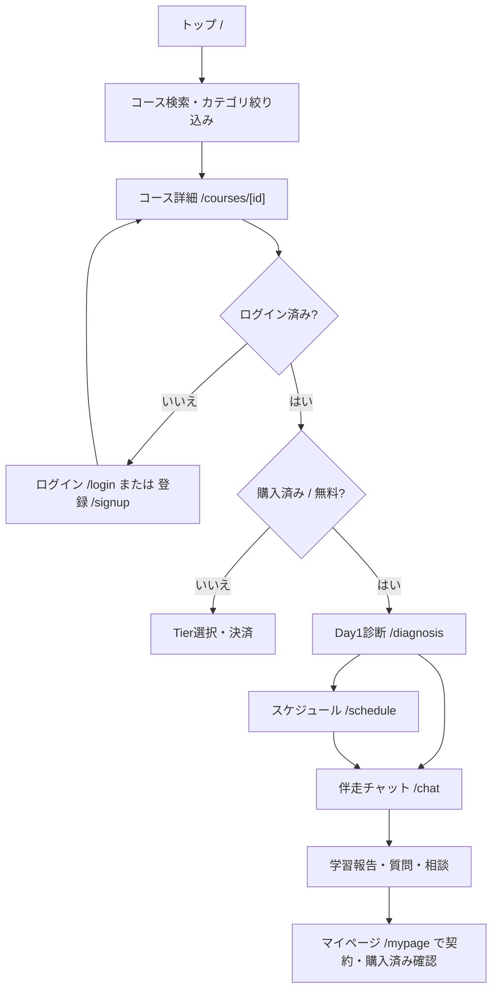

主な利用の流れ:

1. トップでコース一覧、キーワード検索、カテゴリ絞り込み、新着コースを確認する。
2. コース詳細でクリエイター、価格、Tier A/B、レッスン、30日伴走導線を確認する。
3. 未ログインの場合はログインまたは新規登録へ遷移する。
4. 未購入の場合は買い切り決済または月額サブスクを開始する。
5. 購入後はDay1診断、チャット、スケジュールに進む。

### 2.2 コース申し込みフロー

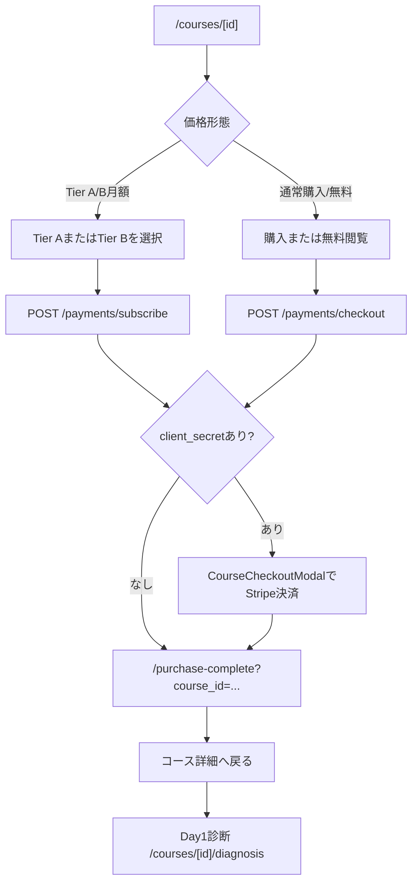

Tierの意味:

| Tier | 内容 | 学習者体験 |
|---|---|---|
| Tier A | AIのみ伴走 | 質問はAIが分類・回答。必要に応じて紐付けコンテンツを提示 |
| Tier B | AI + クリエイター添削 | 1日1回までクリエイター確認対象。AI下書きをクリエイターが承認・編集して回答 |

### 2.3 30日コース実施フロー

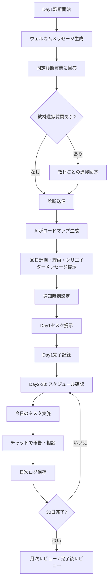

Day1診断で取得する情報:

| 項目 | 入力形式 | 利用目的 |
|---|---|---|
| 現在スコア | 数値または未受験 | 現在地分析、差分算出 |
| 目標スコア | 数値 | ゴールとの差分算出 |
| 試験予定 | 選択式 | 期間制約の把握 |
| 1日の学習時間 | 選択式 | 個別タスク配分の上限 |
| 苦手分野 | 複数選択 | タスク配分の重み付け |
| 学習歴 | テキスト | 声かけ・計画理由に反映 |
| 使用教材 | 任意テキスト | タスク文脈に反映 |
| 教材進捗 | コース教材ごと | Layer2の個別配分で既習/未習を調整 |

### 2.4 1日のサイト利用UIフロー

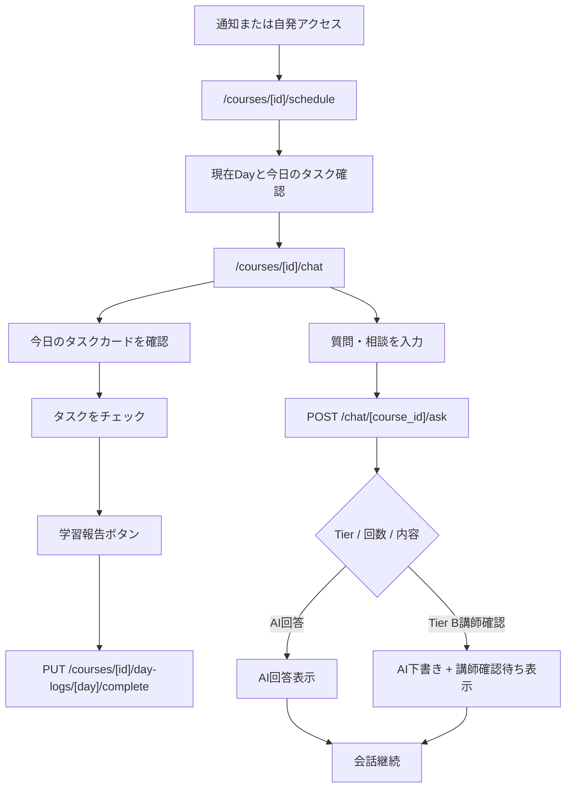

UI上の主要要素:

| 画面 | 要素 |
|---|---|
| スケジュール | 30日進捗バー、週ごとの7日グリッド、完了/本日/休息日表示、今日のタスクカード、日別詳細モーダル |
| チャット | クリエイターアバター、Tier表示、30日進捗、今日のタスクチェック、学習報告ボタン、質問入力、クイックアクション、回答履歴 |

---

## 3. クリエイターフロー

### 3.1 クリエイター申請フロー

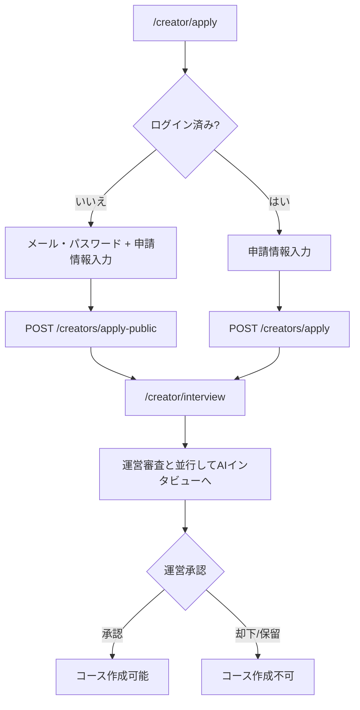

申請情報:

| 項目 | 目的 |
|---|---|
| 表示名 / 名前 | クリエイター識別 |
| 専門分野 | コース領域の確認 |
| 指導実績 | 専門性確認 |
| SNS / ブログ等 | 実在性・活動実績確認 |

### 3.2 コース作成フロー

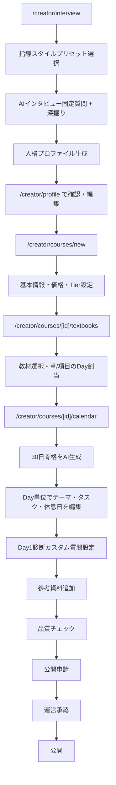

重要な設計原則:

| 原則 | 内容 |
|---|---|
| 1クリエイター = 1人格 | コースごとにキャラクターを選択しない。AIインタビュー完了時に人格/キャラクターが作成される |
| Layer1 | クリエイター・コース共通の30日骨格。全学習者に共通 |
| Layer2 | 学習者診断後に、30日骨格のタスク分量を個別化 |
| Layer3 | 日次通知・チャット応答など、その場の文脈で動的生成 |

### 3.3 学習者対応フロー

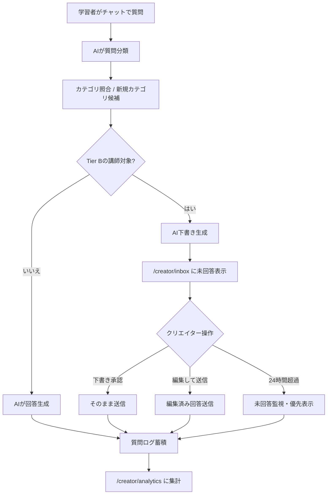

クリエイター側の対応画面:

| 画面 | 用途 |
|---|---|
| `/creator/inbox` | Tier Bの未回答質問を確認し、AI下書きを承認または編集して送信 |
| `/creator/analytics` | 質問カテゴリランキング、AI提案カテゴリ承認、質問一覧、コンテンツ紐付け |
| `/creator/courses/[id]/enrollments` | コース申込者一覧の確認 |
| `/creator/revenue` | 売上確認 |

### 3.4 その他関連フロー

#### 質問分析・コンテンツ改善ループ

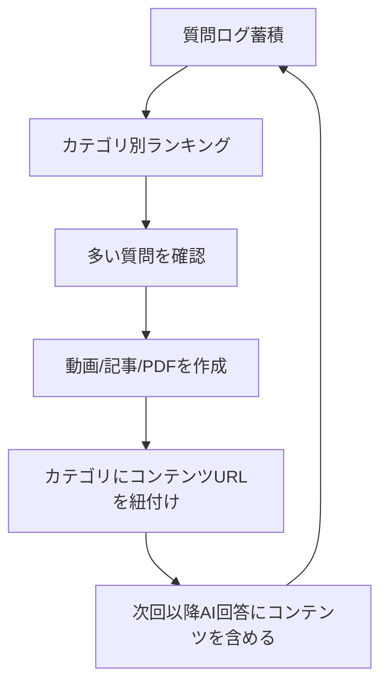

#### 収益確認フロー

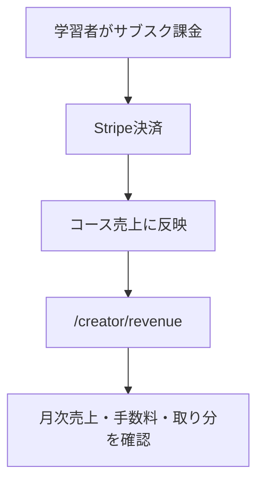

---

## 4. 運営フロー

### 4.1 管理画面フロー

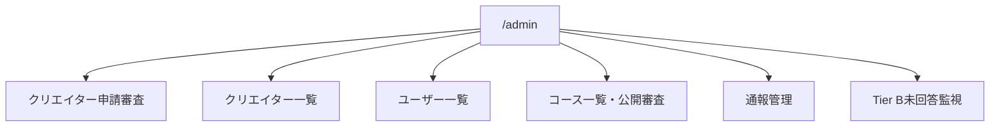

### 4.2 クリエイター審査

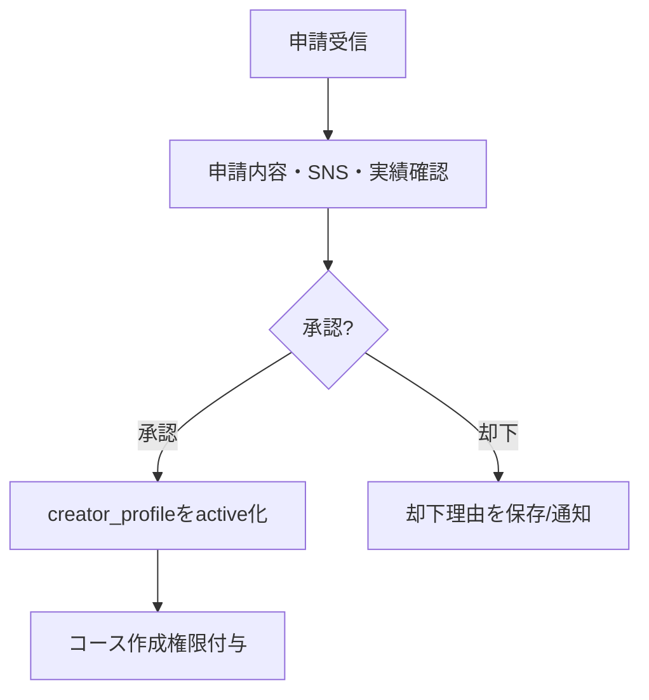

### 4.3 コース審査・公開管理

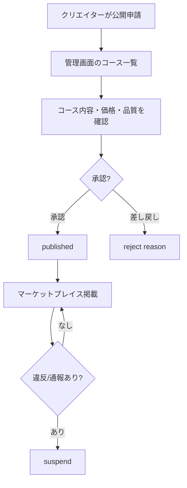

### 4.4 通報・監視

| フロー | 内容 |
|---|---|
| 通報管理 | 学習者がコース等を通報 → `/admin` の通報管理タブで確認 → 解決済みにする |
| Tier B監視 | 24時間超過の未回答質問を一覧化 → クリエイター対応の遅延を検知 |
| ユーザー管理 | 顧客一覧、情報更新、パスワード再発行、削除 |
| クリエイター停止/復帰 | クリエイター一覧から停止または再有効化 |

---

## 5. 画面遷移まとめ

### 5.1 学習者

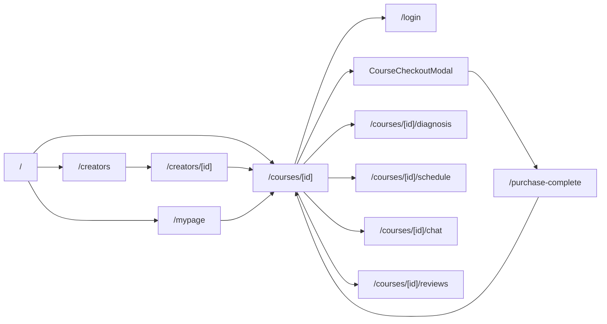

### 5.2 クリエイター

```mermaid
flowchart LR
  A["/dashboard"] --> B["/creator/apply"]
  A --> C["/creator/interview"]
  C --> D["/creator/profile"]
  A --> E["/creator/courses"]
  E --> F["/creator/courses/new"]
  F --> G["/creator/courses/[id]/textbooks"]
  G --> H["/creator/courses/[id]/calendar"]
  E --> H
  E --> I["/creator/courses/[id]/enrollments"]
  A --> J["/creator/inbox"]
  A --> K["/creator/analytics"]
  A --> L["/creator/revenue"]
```

### 5.3 学習者: 状態別画面遷移

学習者は、ログイン状態・コース申込状態・Day1診断状態・30日学習状態によって見えるCTAと自然な遷移先が変わる。

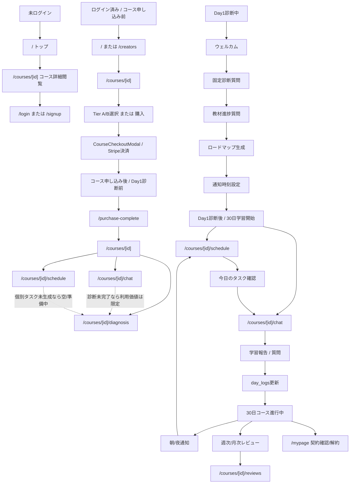

状態別の画面制御:

| 状態 | 判定に使う主なデータ | 主CTA | 補足 |
|---|---|---|---|
| 未ログイン | JWTなし | ログイン / 新規登録 | コース詳細は閲覧可能。購入・通報・学習画面はログインへ誘導 |
| コース申し込み前 | `is_purchased=false` かつ無料でない | Tier選択 / 購入 | チャット・診断・スケジュールは購入後導線 |
| コース申し込み後 / Day1診断前 | 購入済み、`learner_roadmap`なし | Day1診断を始める | チャットやスケジュールへの導線はあるが、最初の自然導線は診断 |
| Day1診断中 | 診断フォーム進行中 | 質問回答、通知設定 | 診断送信で `learner_profiles` / `learner_roadmaps` / `learner_course_days` を生成 |
| Day1診断後 | `learner_roadmap`あり | スケジュール確認 / チャットで報告 | 30日個別タスク、通知、日次ログが利用可能 |
| 30日進行中 | `day_logs`が1〜29日完了 | 今日のタスク、質問、報告 | 未活動時はリマインド、7日/30日単位でレビュー生成 |
| 30日完了後 | `day_logs`が30日完了 | レビュー確認、次コース検討 | 完了後の再診断/継続設計は今後整理余地あり |

### 5.4 クリエイター: 状態別画面遷移

クリエイターは、申請状態・人格生成状態・コース作成状態・コース審査状態によって、作成可能な操作が段階的に増える。

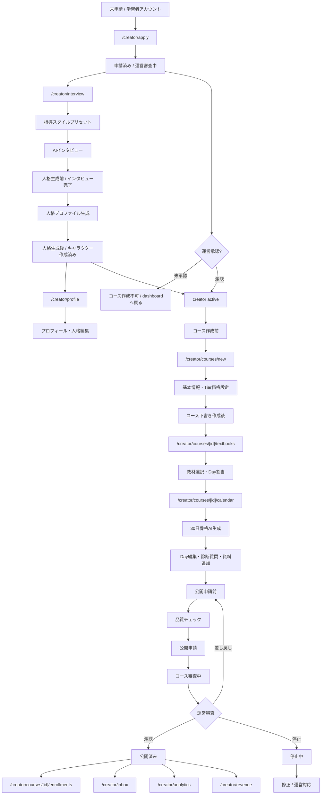

状態別の画面制御:

| 状態 | 判定に使う主なデータ | 主CTA | 補足 |
|---|---|---|---|
| 未申請 | `role=learner` または `creator_profile`なし | クリエイター申請 | 未ログインなら登録込み申請 |
| 申請済み / 審査中 | `creator_profile.status=pending` | AIインタビューへ | 審査と人格作成は並行可能 |
| 人格生成前 | `personality_profile`なし、または `characters`なし | AIインタビュー / 人格生成 | コース新規作成時は人格作成を促す |
| 人格生成後 | `personality_profile`あり、`characters`あり | プロフィール確認、コース作成 | 1クリエイター=1人格。キャラクター選択UIは出さない |
| creator承認前 | `creator_profile.status`がactive以外 | コース作成不可 | `/creator/courses/new`ではdashboardへ戻す |
| コース作成前 | active、人格あり、作成コースなし | 新しいコースを作る | `/creator/courses/new`が入口 |
| コース下書き作成後 | `courses.status=draft`、`course_days`未生成または編集中 | 教材設定、30日生成、Day編集 | `/textbooks` → `/calendar` が基本導線 |
| 公開申請前 | draft、30日生成済み | 品質チェック、公開申請 | 参考資料/診断質問もこの段階で調整 |
| コース審査中 | `courses.status=review` | 運営承認待ち | クリエイター側は待機表示 |
| 公開済み | `courses.status=published` | 申込者確認、質問対応、分析、売上確認 | 学習者の購入・診断・チャットが本格稼働 |
| 差し戻し/停止中 | reject相当または `is_suspended=true` | 修正、運営対応 | マーケットプレイス露出や購入導線を制限 |

### 5.5 運営

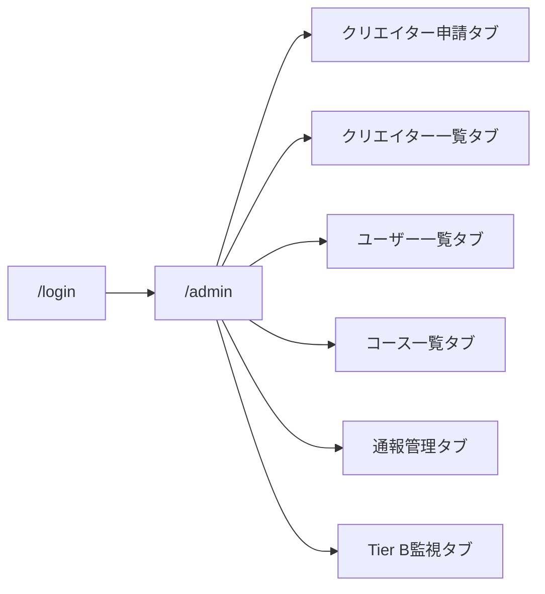

---

## 6. 画面詳細

### 6.1 共通・認証

| パス | 画面名 | 対象 | 主な表示/操作 | 主なAPI |
|---|---|---|---|---|
| `/` | トップ/マーケットプレイス | 全員 | コース検索、カテゴリ絞り込み、新着コース、ログイン/登録、クリエイター申請CTA | `GET /courses`, `GET /stats/public`, `GET /auth/me` |
| `/login` | ログイン | 未ログイン | メール/パスワードログイン、2FA導線 | `POST /auth/login`, `POST /auth/verify-2fa` |
| `/signup` | 新規登録 | 未ログイン | メール/パスワード登録 | `POST /auth/signup` |
| `/forgot-password` | パスワードリセット申請 | 未ログイン | メール送信 | `POST /auth/forgot-password` |
| `/reset-password` | パスワード再設定 | 未ログイン | 新パスワード設定 | `POST /auth/reset-password` |
| `/change-password` | パスワード変更 | ログイン済み | 現在/新パスワード入力 | `POST /auth/change-password` |
| `/mypage` | マイページ | 学習者 | 購入済みコース、通知、退会、契約導線 | `GET /courses/me/purchased`, `POST /customers/me/withdraw` |

### 6.2 学習者向け

| パス | 画面名 | 主な表示/操作 | 主なAPI |
|---|---|---|---|
| `/creators` | クリエイター一覧 | クリエイター検索/一覧、お気に入り導線 | `GET /creators`, `GET /favorites` |
| `/creators/[id]` | クリエイター詳細 | プロフィール、コース一覧、お気に入り | `GET /creators/[id]`, `GET /creators/[id]/courses` |
| `/courses/[id]` | コース詳細 | サムネイル、クリエイター、価格、Tier選択、購入/解約/Tier変更、Day1/チャット/スケジュール導線、レッスン閲覧、通報 | `GET /courses/[id]`, `POST /payments/checkout`, `POST /payments/subscribe`, `POST /payments/subscriptions/[id]/cancel`, `POST /payments/subscriptions/[id]/change-tier`, `POST /admin/reports` |
| `/purchase-complete` | 購入完了 | 決済後の完了表示、コースへ戻る | 決済状態に依存 |
| `/courses/[id]/diagnosis` | Day1診断 | ウェルカム、固定質問、教材進捗、ロードマップ結果、通知設定、Day1完了 | `GET /courses/[id]`, `POST /diagnosis/[id]/welcome`, `GET /diagnosis/[id]/questions`, `POST /diagnosis/[id]/submit`, `GET /diagnosis/[id]/roadmap`, `PUT /diagnosis/[id]/notification-settings`, `PUT /courses/[id]/day-logs/1/complete` |
| `/courses/[id]/schedule` | 30日スケジュール | 30日グリッド、進捗、今日のタスク、日別詳細、チャット導線 | `GET /courses/[id]/days`, `GET /courses/[id]/day-logs`, `GET /diagnosis/[id]/learner-days` |
| `/courses/[id]/chat` | 伴走チャット | 今日のタスク、学習報告、質問入力、AI/講師回答、Tier BアップグレードCTA | `GET /chat/[id]/history`, `POST /chat/[id]/ask`, `GET /courses/[id]/day-logs`, `PUT /courses/[id]/day-logs/[day]/complete` |
| `/courses/[id]/reviews` | レビュー | 週次/月次レビュー確認 | `GET /diagnosis/[id]/reviews` |

### 6.3 クリエイター向け

| パス | 画面名 | 主な表示/操作 | 主なAPI |
|---|---|---|---|
| `/dashboard` | ダッシュボード | クリエイター導線、作成済みコース、通知、学習者側導線 | `GET /auth/me`, `GET /notifications` など |
| `/creator/apply` | クリエイター申請 | 申請フォーム。未ログインの場合は登録込み申請 | `POST /creators/apply`, `POST /creators/apply-public` |
| `/creator/interview` | AIインタビュー | 指導スタイルプリセット、チャット形式質問、人格プロファイル生成 | `POST /interview/start`, `POST /interview/answer`, `POST /interview/generate-profile` |
| `/creator/profile` | クリエイタープロフィール/人格確認 | プロフィール更新、人格プロファイル編集、自己紹介生成 | `GET /creators/me`, `PUT /creators/me`, `GET /interview/profile`, `PUT /interview/profile`, `POST /creators/me/generate-intro` |
| `/creator/courses` | 作成コース一覧 | コース一覧、ステータス、申込者数、編集/申込者一覧導線 | `GET /courses/me/created` |
| `/creator/courses/new` | コース新規作成 | 1人格表示、タイトル、ゴール、対象者、学習強度、進行速度、Tier価格 | `GET /characters`, `POST /courses` |
| `/creator/courses/[id]/textbooks` | 教材設定 | 教材検索、コース教材追加、章/項目のDay割当、自動割当 | `GET /textbooks`, `GET/POST /courses/[id]/textbooks`, `PUT /course-textbooks/[id]`, `PUT /course-textbooks/[id]/day-assignments` |
| `/creator/courses/[id]/calendar` | 30日カレンダー編集 | AI生成、Day編集、参考資料、Day1診断質問、品質チェック、公開申請 | `POST /courses/[id]/generate-days`, `GET /courses/[id]/generation-status`, `GET/PUT /courses/[id]/days`, `GET/POST /courses/[id]/materials`, `GET/POST /courses/[id]/diagnosis-questions`, `GET /courses/[id]/quality-check`, `POST /courses/[id]/submit-for-review` |
| `/creator/courses/[id]/enrollments` | 申込者一覧 | 申込者確認 | `GET /courses/[id]/enrollments` |
| `/creator/inbox` | Tier B未回答質問 | AI下書き、編集、承認送信、24時間超過表示 | `GET /chat/creator/pending`, `POST /chat/creator/questions/[id]/respond`, `GET /chat/creator/pending/overdue-count` |
| `/creator/analytics` | 質問分析 | カテゴリランキング、AI提案カテゴリ承認/却下、質問一覧、コンテンツ紐付け | `GET /chat/creator/analytics`, `GET /chat/creator/categories/pending`, `PUT /chat/creator/categories/[id]/approve`, `PUT /chat/creator/categories/[id]/reject`, `POST /chat/creator/categories/[id]/contents` |
| `/creator/revenue` | 売上 | 売上・収益確認 | `GET /creators/me/revenue` |

### 6.4 運営向け

`/admin` はタブ式の単一管理画面。

| タブ | 主な表示/操作 | 主なAPI |
|---|---|---|
| クリエイター申請 | 申請一覧、承認、却下 | `GET /admin/creator-applications`, `PUT /admin/creator-applications/[id]/approve`, `PUT /admin/creator-applications/[id]/reject` |
| クリエイター一覧 | クリエイター一覧、停止、再有効化 | `GET /admin/creators`, `PUT /admin/creators/[id]/suspend`, `PUT /admin/creators/[id]/reactivate` |
| ユーザー一覧 | 顧客一覧、更新、パスワード再発行、削除 | `GET /customers`, `PATCH /customers/[id]`, `POST /customers/[id]/reissue-password`, `DELETE /customers/[id]` |
| コース一覧 | 全コース、承認、差し戻し、停止、停止解除、削除 | `GET /admin/courses`, `PUT /admin/courses/[id]/approve`, `PUT /admin/courses/[id]/reject`, `PUT /admin/courses/[id]/suspend`, `PUT /admin/courses/[id]/unsuspend`, `DELETE /admin/courses/[id]` |
| 通報管理 | 通報一覧、解決 | `GET /admin/reports`, `PUT /admin/reports/[id]/resolve` |
| Tier B監視 | 24時間超過の未回答質問 | `GET /admin/tier-b-overdue` |

---

## 7. プロンプト利用箇所一覧

### 7.1 クリエイター人格・プロフィール

| ファイル | 定数/関数 | 使うタイミング | 入力 | 出力/用途 |
|---|---|---|---|---|
| `backend/app/core/personality_prompts.py` | `FIXED_QUESTIONS` | `/creator/interview` 開始時 | なし | 固定インタビュー質問 |
| 同上 | `FOLLOW_UP_DECISION_SYSTEM`, `build_follow_up_decision_messages` | クリエイター回答後 | 質問・回答 | 深掘り質問を出すか判定 |
| 同上 | `PROFILE_GENERATION_SYSTEM`, `build_profile_generation_messages` | インタビュー完了後 | QA履歴、プリセット | 人格プロファイルJSON |
| 同上 | `BASE_TYPE_HINTS` | インタビュー開始時 | 指導スタイルプリセット | プロファイル生成時の補助ヒント |
| 同上 | `build_personality_system_prompt` | コース生成/チャット等 | 人格プロファイル | 人格を反映する共通system prompt |
| `backend/app/core/creator_prompts.py` | `SELF_INTRO_SYSTEM`, `build_self_intro_messages` | `/creator/profile` 自己紹介生成 | 人格、専門分野、実績 | 学習者向け自己紹介文 |

### 7.2 コース作成・品質チェック

| ファイル | 定数/関数 | 使うタイミング | 入力 | 出力/用途 |
|---|---|---|---|---|
| `backend/app/core/course_generation_prompts.py` | `COURSE_DAY_GENERATION_SYSTEM`, `build_course_day_generation_messages` | `/creator/courses/[id]/calendar` で30日生成 | 人格、コース名、ゴール、対象者、学習強度、教材Day割当、進行速度 | 30日分のLayer1骨格JSON |
| 同上 | `TASK_TYPES`, `WEEK_PHASES` | コース生成 | なし | タスク種別・週フェーズ制約 |
| `backend/app/core/quality_check_prompts.py` | `GOAL_FIT_SYSTEM`, `build_goal_fit_messages` | 公開申請前の品質チェック | ゴール、対象者、学習時間、進行速度 | 目標と学習時間の整合性スコア/改善提案 |

### 7.3 Day1診断・個別化

| ファイル | 定数/関数 | 使うタイミング | 入力 | 出力/用途 |
|---|---|---|---|---|
| `backend/app/core/diagnosis_prompts.py` | `FIXED_QUESTIONS` | `/courses/[id]/diagnosis` | なし | Day1固定診断質問 |
| 同上 | `WELCOME_MESSAGE_SYSTEM`, `build_welcome_message_messages` | Day1開始時 | 人格プロファイル | ウェルカムメッセージ |
| 同上 | `ROADMAP_GENERATION_SYSTEM`, `build_roadmap_generation_messages` | 診断送信後 | 診断結果、人格、週テーマ | レベル分析、理由、週次計画、Day1タスク、クリエイターメッセージ |
| `backend/app/core/personalize_prompts.py` | `PERSONALIZE_SYSTEM`, `build_personalize_messages` | 診断送信後 | 診断結果、Layer1骨格、教材進捗 | 学習者別Layer2タスク配分 |

### 7.4 チャット・質問対応・通知

| ファイル | 定数/関数 | 使うタイミング | 入力 | 出力/用途 |
|---|---|---|---|---|
| `backend/app/core/chat_prompts.py` | `INJECTION_PATTERNS`, `check_injection` | 質問受信時 | 学習者メッセージ | プロンプトインジェクション検知 |
| 同上 | `CLASSIFY_SYSTEM`, `build_classify_messages` | 質問受信時 | 質問文、既存カテゴリ | カテゴリ名、message_type |
| 同上 | `build_answer_system`, `build_answer_messages` | AI回答/Tier B下書き生成 | 人格、質問、紐付けコンテンツ、今日のタスク、最近の要約 | AI回答本文 |
| 同上 | `select_answer_model`, `needs_escalation` | AI回答前 | message_type、質問文 | 軽量/高性能モデルの選択 |
| 同上 | `build_today_message_system`, `build_today_message_user` | 朝/夜通知、今日の声かけ | 人格、Day、今日のタスク、最近の要約 | 日次メッセージ |
| 同上 | `build_reminder_message_system`, `build_reminder_message_user` | 未活動リマインド | 人格、未活動日数、段階 | 段階別リマインド文 |
| 同上 | `DAILY_SUMMARY_SYSTEM`, `build_daily_summary_messages` | 1日の会話終了時 | 会話ログ | 日次サマリー |
| 同上 | `DAILY_CLOSE_SIGNALS`, `is_daily_close_signal` | チャット内 | 学習者発話 | 日次サマリー作成トリガー |

### 7.5 レビュー・定期処理

| ファイル | 定数/関数 | 使うタイミング | 入力 | 出力/用途 |
|---|---|---|---|---|
| `backend/app/core/diagnosis_prompts.py` | `WEEKLY_REVIEW_SYSTEM`, `build_weekly_review_messages` | 7日ごとのレビュー生成 | 完了日数、タスク、質問カテゴリ、人格 | 週次レビューJSON |
| 同上 | `MONTHLY_REVIEW_SYSTEM`, `build_monthly_review_messages` | 30日ごとのレビュー生成 | 完了状況、質問カテゴリ、ロードマップ、人格 | 月次レビューJSON |
| `backend/app/core/review_generation.py` | `generate_due_reviews` | バッチ/定期処理 | 学習プロフィール、ログ、質問 | 週次/月次レビューをDB保存しメール送信 |
| `backend/app/core/daily_notifications.py` | `send_due_notifications` | 通知時刻到来時 | 通知設定、今日のタスク、人格 | 朝/夜通知を生成・送信 |
| 同上 | `check_inactive_reminders` | 未活動チェック | 最終質問/診断日、未活動日数、人格 | 未活動リマインド、4日以上はクリエイター通知 |

### 7.6 AIコンテンツ生成スタジオ

| ファイル | 定数/関数 | 使うタイミング | 入力 | 出力/用途 |
|---|---|---|---|---|
| `backend/app/core/studio_prompts.py` | `CHARACTER_CONCEPT_SYSTEM`, `build_character_concept_messages` | スタジオでキャラ案生成 | キャラクターイメージ | キャラ設定JSON |
| 同上 | `CONSULT_SYSTEM`, `build_consult_messages` | コンテンツ企画相談 | テーマ | タイトル案、構成、対象レベル |
| 同上 | `RAW_CONTENT_SYSTEM`, `build_raw_content_messages` | 教材本文生成 | テーマ、構成、対象レベル | プレーンな教材本文 |
| 同上 | `VOICED_CONTENT_SYSTEM_TEMPLATE`, `build_voiced_content_system`, `build_voiced_content_messages` | キャラ口調変換 | キャラ設定、本文 | 口調変換済み本文 |
| 同上 | `SCRIPT_SYSTEM`, `build_script_messages` | YouTube台本化 | 口調変換済み本文 | 動画台本 |
| 同上 | `PREVIEW_SYSTEM_TEMPLATE`, `build_preview_system`, `build_preview_messages` | キャラ口調プレビュー | キャラ設定、サンプル文 | 短文の口調変換 |

---

## 8. 主要データの流れ

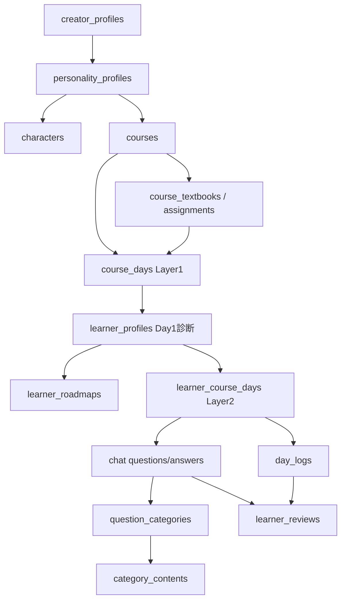

---

## 9. 実装上の注意点・未整理ポイント

| 項目 | 現状 | 整理ポイント |
|---|---|---|
| 画面名のズレ | 既存基本設計では `/chat/[course_id]` 等の旧パス表記があるが、現行実装は `/courses/[id]/chat` | 基本設計書側を現行パスに更新する余地あり |
| 教材の扱い | 旧設計では「参考資料は生成に使わない」とあるが、現行実装では教材Day割当を30日生成に渡している | v1.1設計を現行Layer1方式へ更新する必要あり |
| 文字化け | 一部TS/Pythonファイルの日本語文字列が表示上文字化けしている | エンコーディング統一/修復が必要 |
| 管理者API | 通報投稿が `POST /admin/reports` に寄っている | 学習者投稿用API名としては `/reports` の方が自然。必要なら整理 |
| コース公開前プレビュー | 設計上は学習者目線プレビューがあるが、現行画面では品質チェック/公開申請が中心 | プレビュー要否を判断 |
| Tier B自動未対応文 | 設計上は24時間未対応時の自動表示があるが、現行UIでは未回答/下書き表示が中心 | 実装状況の追加確認が必要 |
